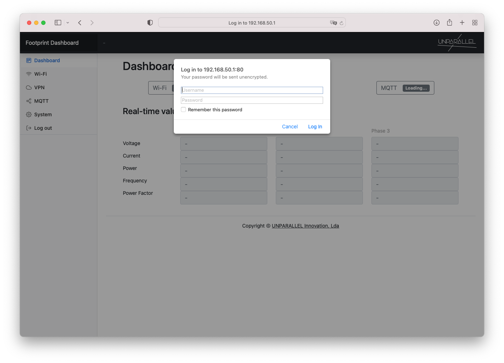

# Access Point
Connect to the Footprint Access Point to open the dashboard and configure Footprint settings.

<center>{width=350px}</center>

<center>
```
Wi-Fi SSID: FootprintAP-XXXXXXXXXXXX
Password: footprint123
```
</center>

## Dashboard
After connecting to the FootprintAP, open the Access Point Router IP, that usually is [http://192.168.50.1/](http://192.168.50.1/){:target="_blank"} and login.



<center>
```
Username: pi
Password: footprint123
```
</center>

After logging in the footprint real-time values will show on the dashboard.


The dashboard can now be used to configure other Footprint settings such as [Wi-Fi](../dashboard/wifi), [VPN](../dashboard/vpn) and [MQTT](../dashboard/mqtt).
