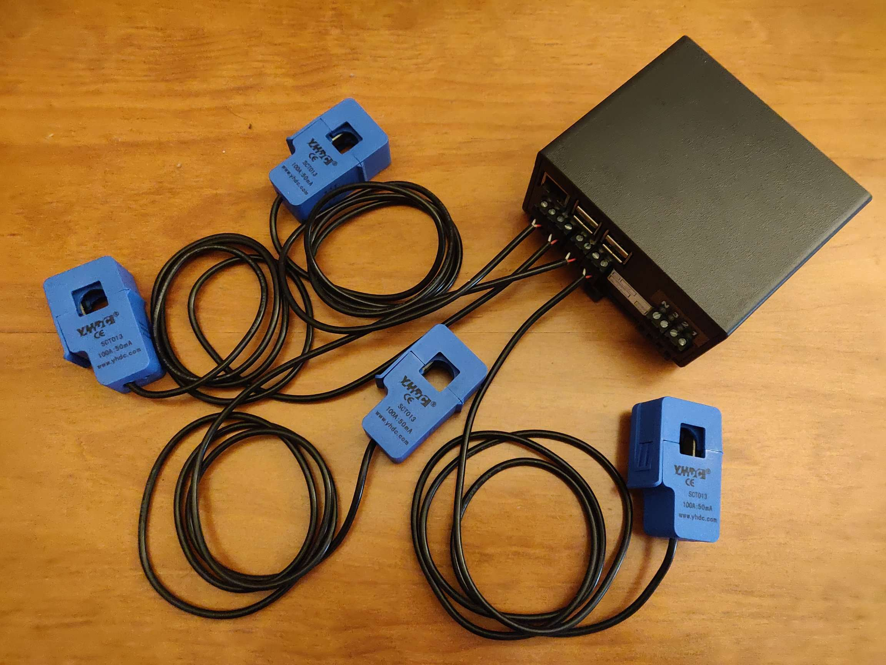
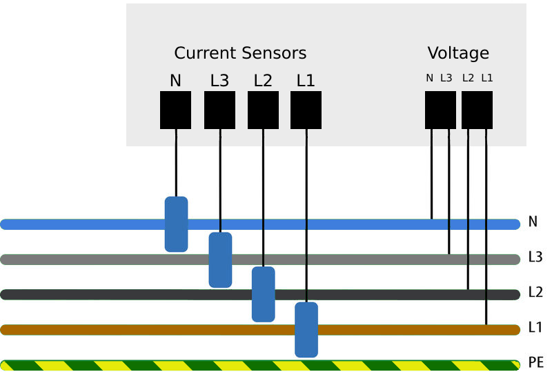

# Footprint connection guide

The device has 4 inputs for current measurement (L1, L2, L3, N) and three inputs for voltage measurement. This allows measurements on all three phases and the neutral conductor.

The system is supplied with the required operating voltage via the L1 voltage connection. A separate power supply is not required.

The housing has a mounting bracket on the back for mounting the system on a DIN rail.

{width=60%}

Install the current sensors on the neutral and each phase and connect them to the corresponding current input on the device. Connect the neutral and each phase to the voltage inputs.

{width=60%}

Please note the arrows on top of the current transducers that indicate the reference direction of current flow.

{width=60%}

