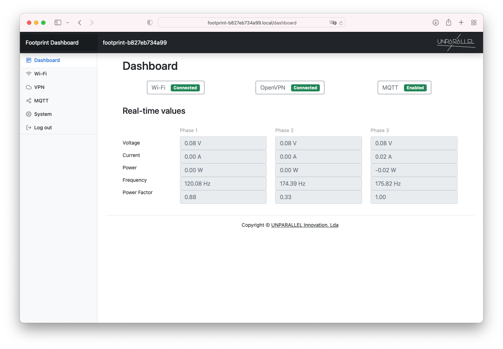
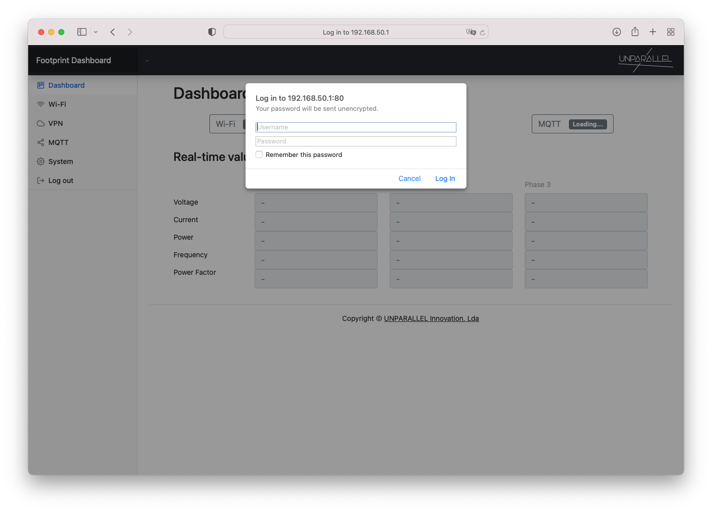
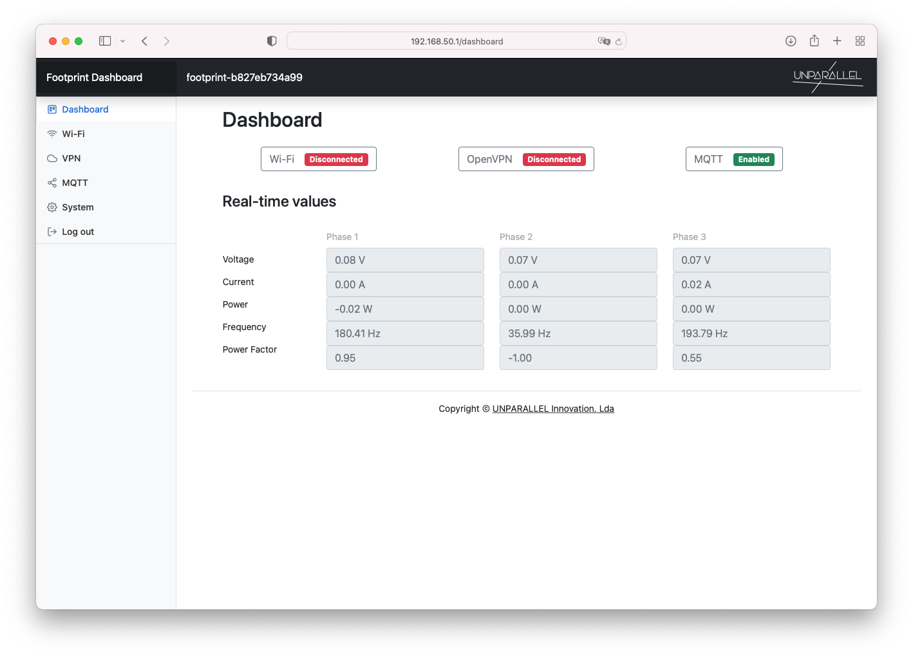

# Footprint Dashboard

The dashboard provides an easy way to view real-time values and configure Footprint settings such as [Wi-Fi](../wifi), [VPN](../vpn) and [MQTT](../mqtt).



## Dashboard
After connecting to the [Footprint Access Point](../../access_point), open the Access Point Router IP, that usually is [http://192.168.50.1/](http://192.168.50.1/){:target="_blank"} and login.

When using a LAN or Wi-Fi network, the dashboard can be opened using Footprint IP address:
```
http://<footprint-IP>/
```

Or using Footprint ID and mDNS `http://<footprint-ID>.local/`

For example:
```
http://footprint-b827eb734a99.local/
```
The unique Footprint ID is displayed on the dashboard header after login.



<center>
```
Username: pi
Password: footprint123
```
</center>

After logging in the footprint real-time values will show on the dashboard.



The dashboard can now be used to configure other Footprint settings.
