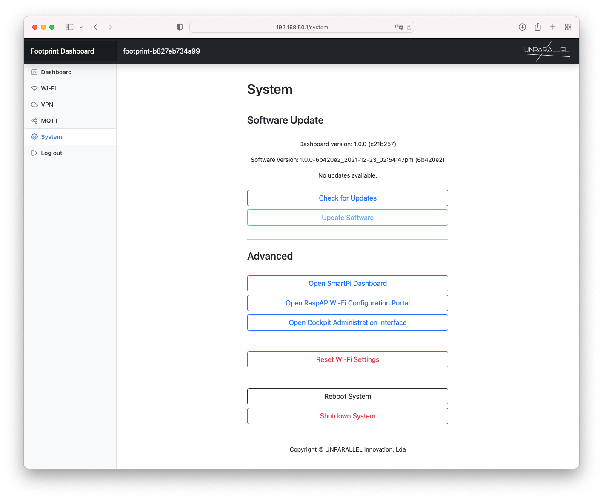

# System

The System tab allows to easily update the Footprint Software and Dashboard.

It also provides an easy way to access other advanced dashboards, reset Wi-Fi to delete all configured networks and shutdown or reboot the device.
