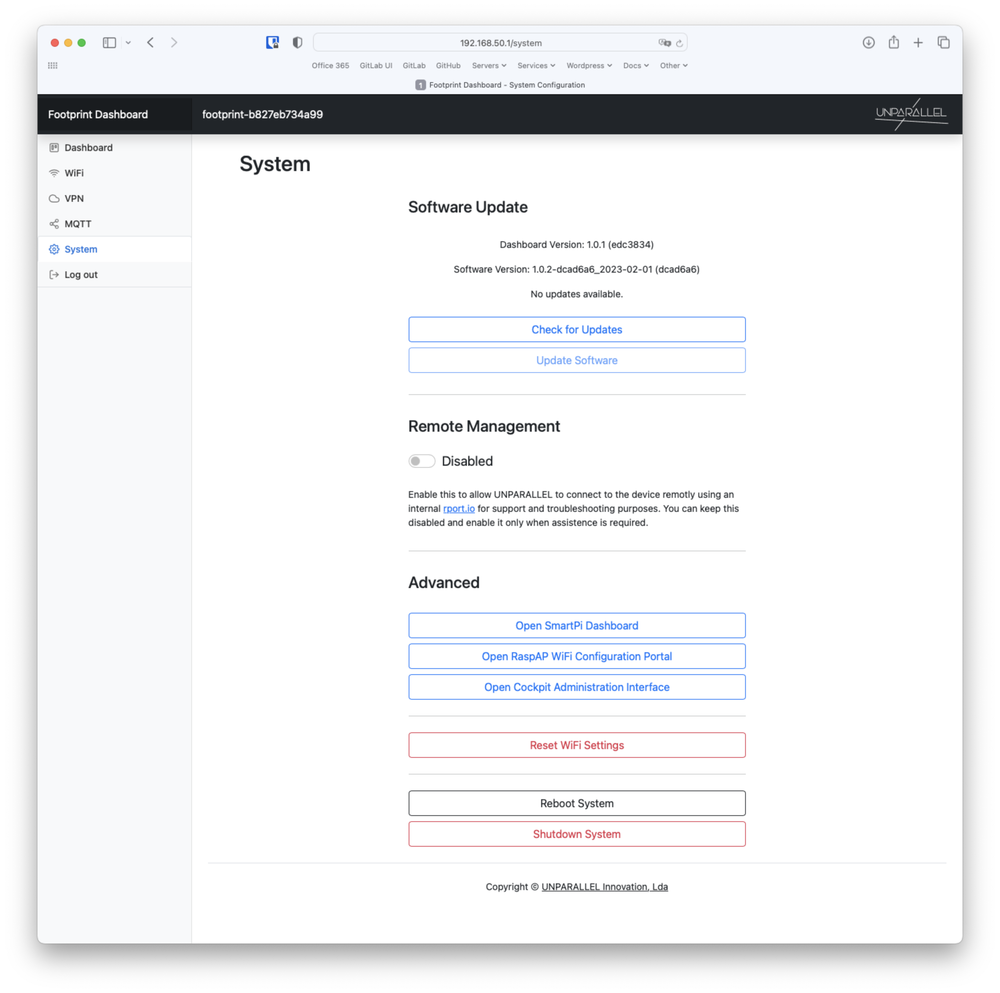

# System

The System tab allows to easily update the Footprint Software and Dashboard.

The Remote Management allows UNPARALLEL to connect to the device remotly using an internal [rport.io](https://rport.io/){:target="_blank"} for support and troubleshooting purposes. You can keep this disabled and enable it only when assistence is required.

The System tab also provides an easy way to access other advanced dashboards, reset Wi-Fi to delete all configured networks and shutdown or reboot the device.

