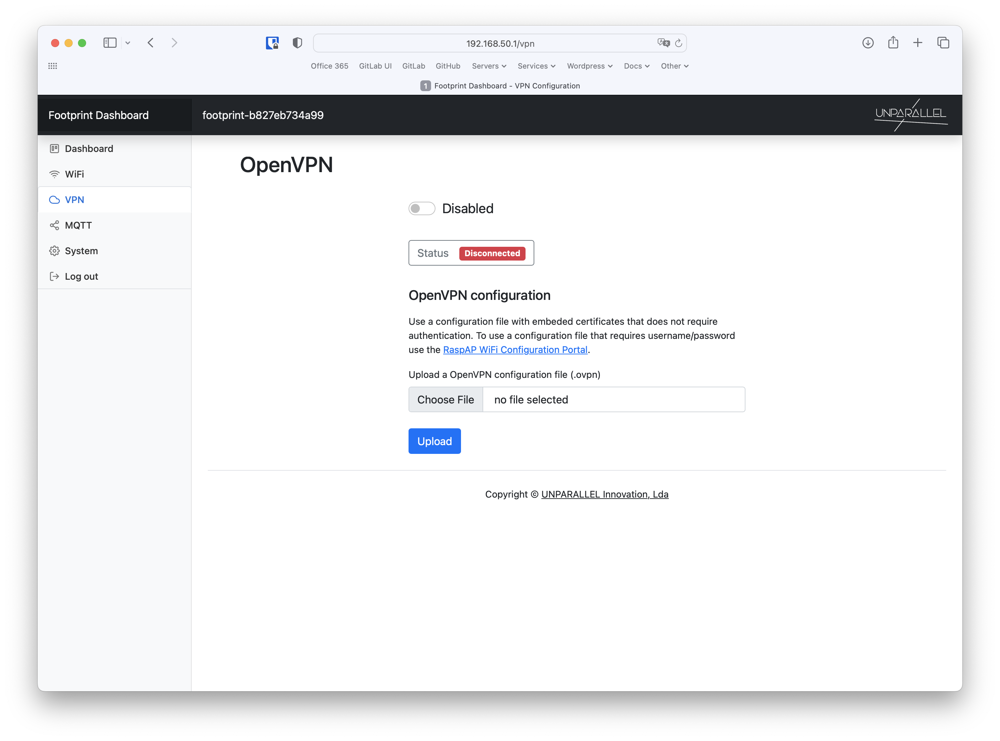

# VPN (optional)

The VPN tab allows to configure an OpenVPN connection.

To enable OpenVPN a vpn client profile (.ovpn file) must be uploaded first. Use a configuration file with embeded certificates that does not require authentication. To use a configuration file that requires username/password use the RaspAP WiFi Configuration Portal, accessible in the [System](../system) tab.

