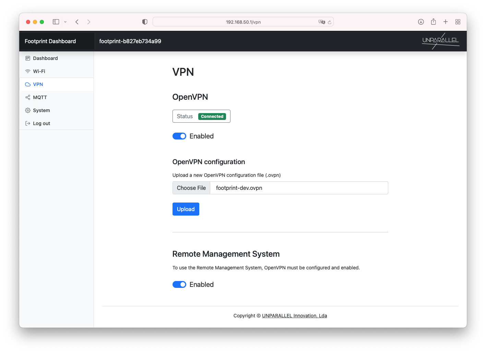

# VPN (optional)

The VPN tab allow to configure an OpenVPN connection that is used to enable the Remote Management System, which provides UNPARALLEL with remote access to the device. This can be used to remotely manage the Footprint device to change configuration, update the device and troubleshoot any issues that might occur.

If desired, use the VPN tab to configure OpenVPN and the Remote Management utility. To enable OpenVPN a vpn client profile (.ovpn file) must be uploaded first.

