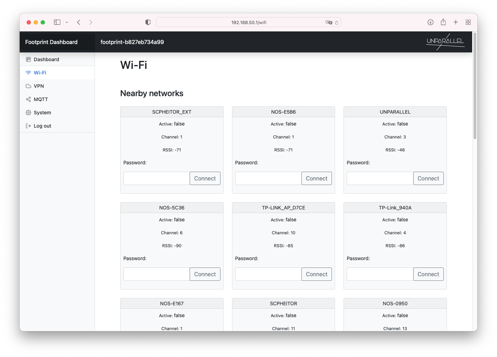
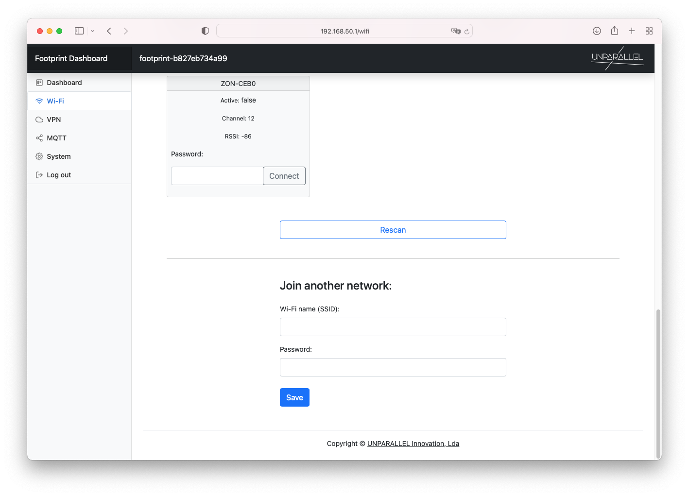
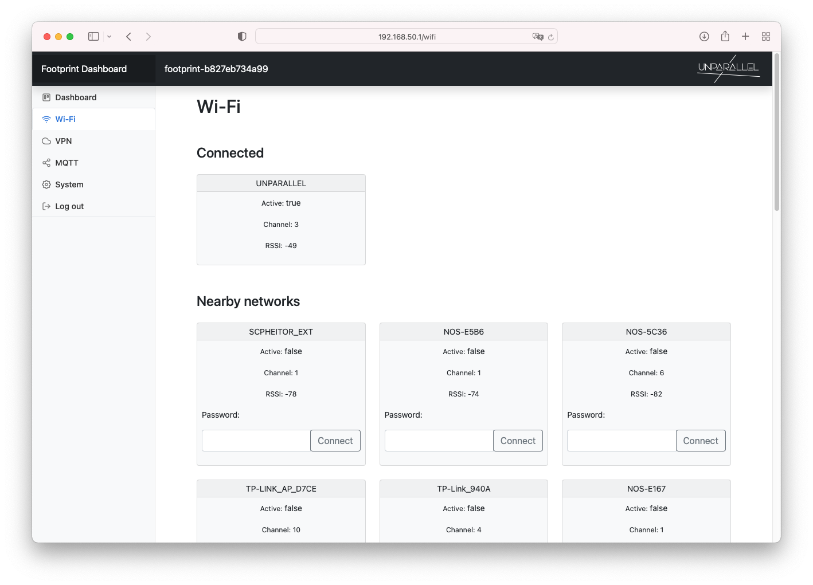

# Wi-Fi

Go to the Wi-Fi tab to connect to an existing Wi-Fi network.

 
If the desired network is not showing on the Nearby Networks list, use the Rescan button to search for Wi-Fi networks. You can also use the Join another network form to manually configure a Wi-Fi network that is not available at the moment.

After connecting, the active Wi-Fi network is shown on the Wi-Fi tab. Sometimes the connection is lost and the webpage may need to be refreshed to show the correct info.

