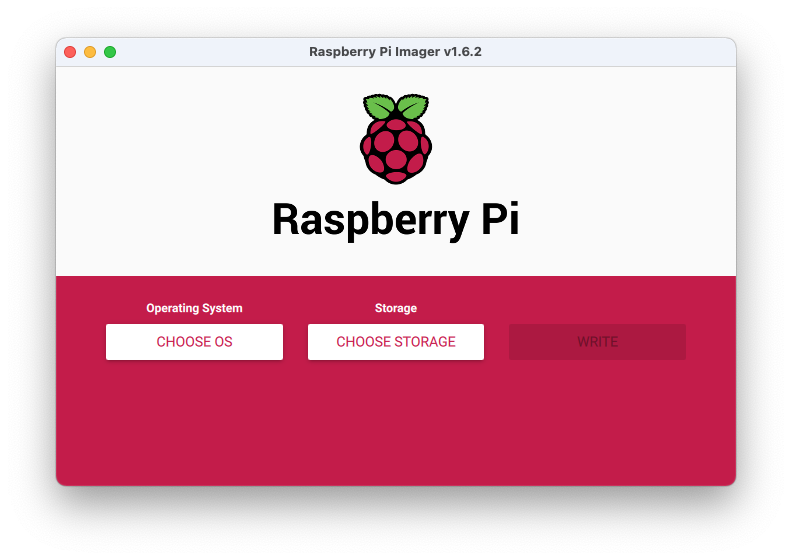
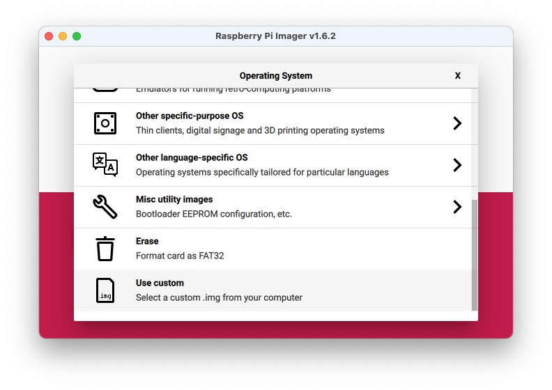
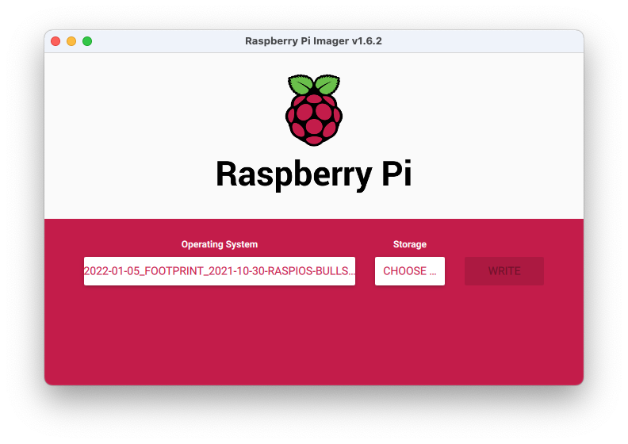
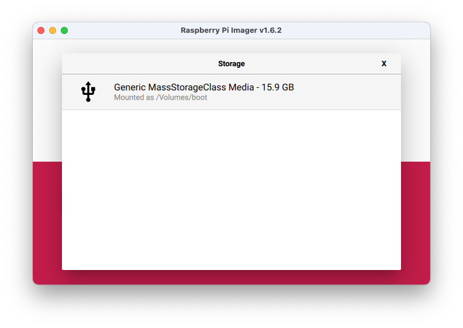
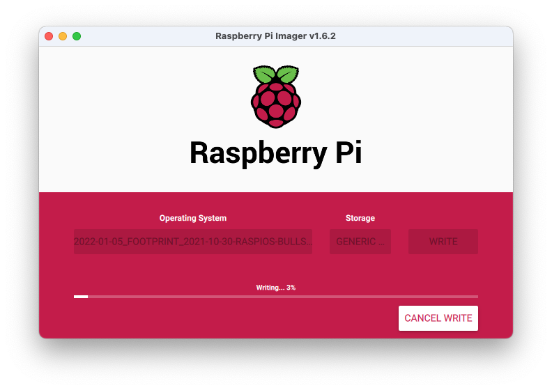
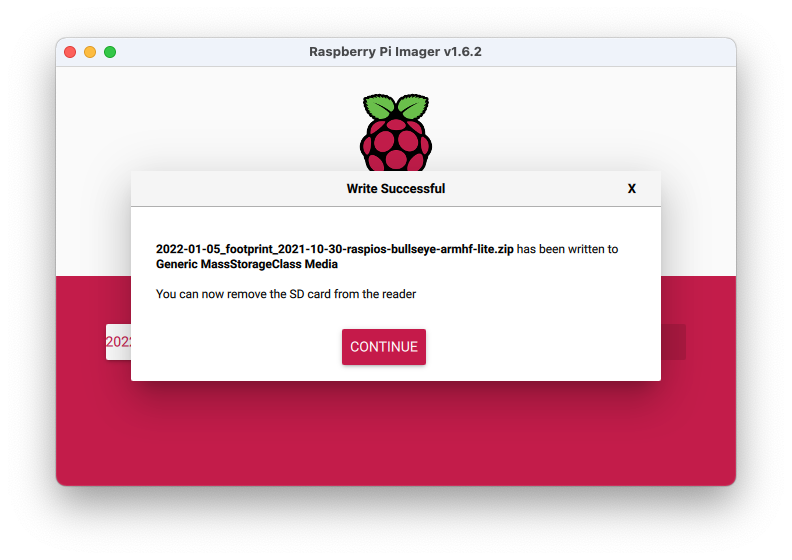

# Flashing the SD Card with Footprint image

To flash the provided image into the SD card you need to download the [Raspberry Pi Imager](https://www.raspberrypi.org/software/){:target="_blank"} for your operating system.

After installing the software connect the SD card provided with Footprint to your computer card reader.

Open the Raspberry Pi Imager, click “CHOOSE OS” and select the “Use Custom” option at the bottom.

Go to the path where the Footprint image zip is located and select it.

Click “CHOOSE STORAGE” and select the SD Card connected to your computer.

The last step is to click “WRITE” and wait for the procedure to finish.

When writing and verifying the image is finished the SD Card will be automatically ejected.

Remove the SD card from the card reader and insert it into the Footprint Raspberry Pi.
